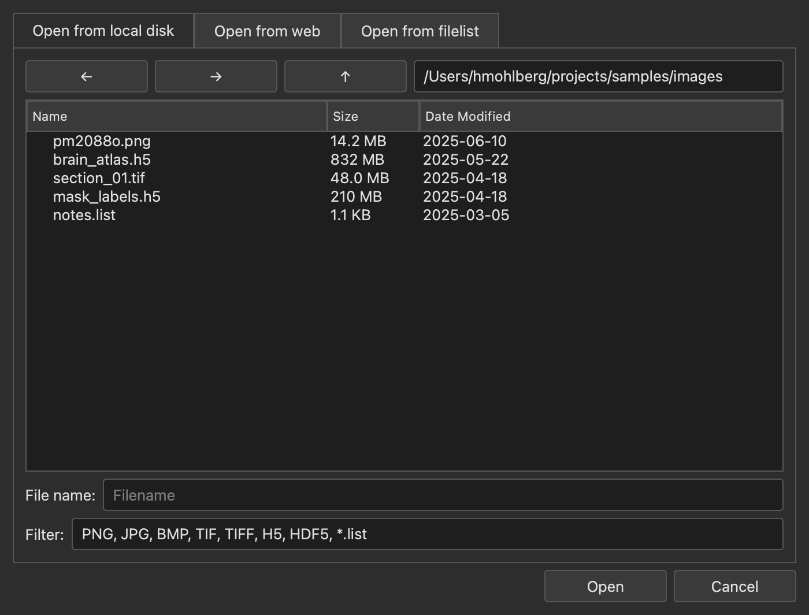
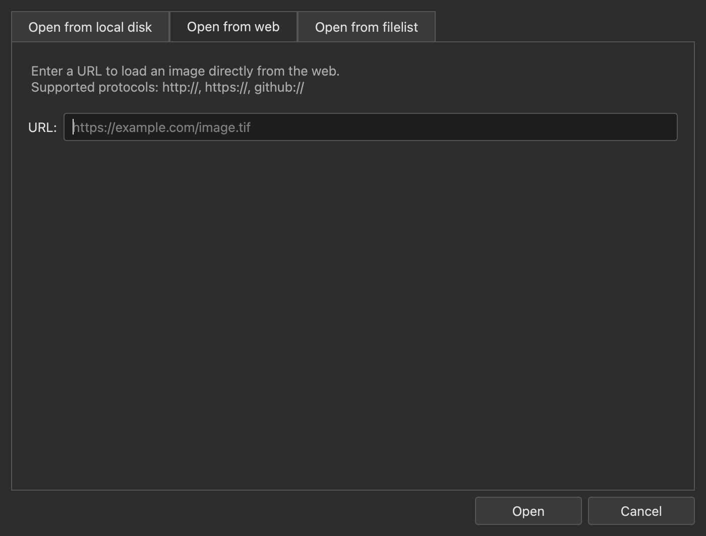
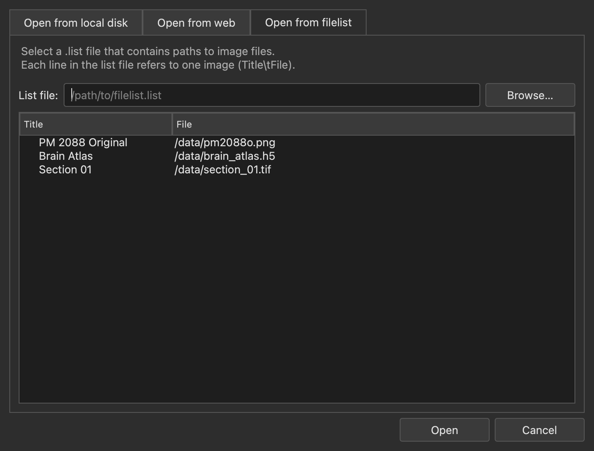
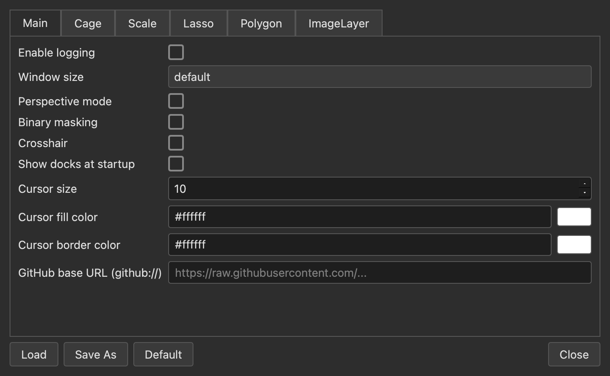
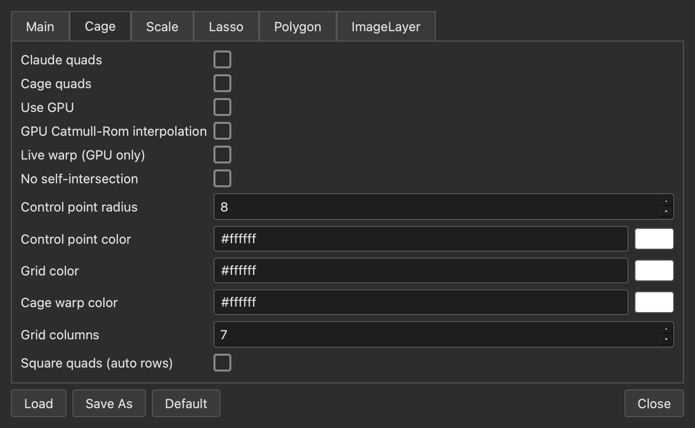
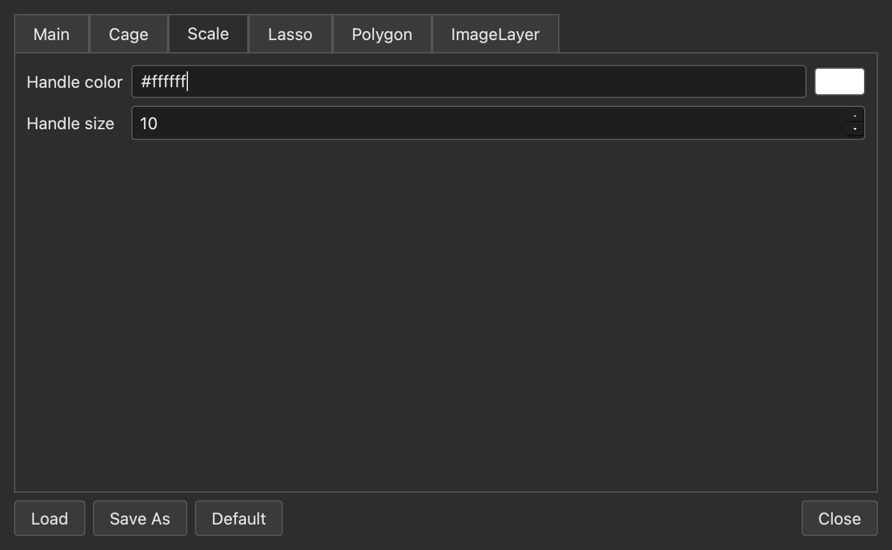
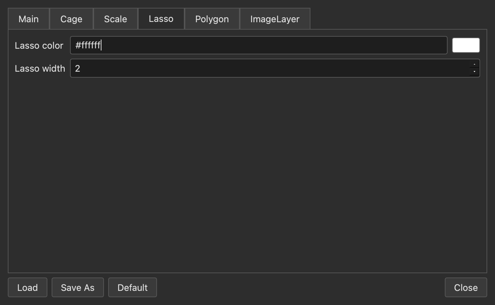
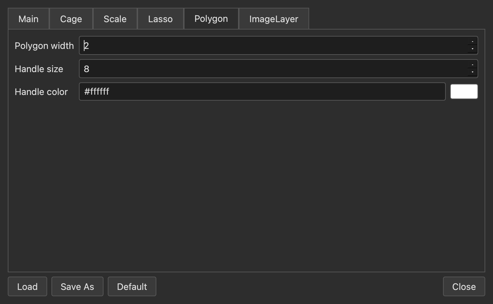
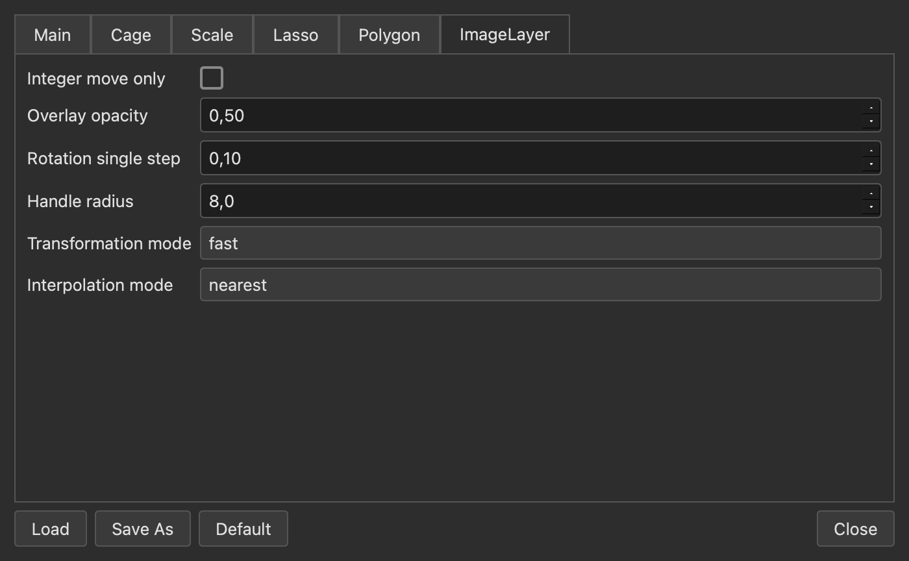

.. _dialogs:

Dialogs
=======

ImageEditor provides two main dialogs: the **Open Image dialog** for loading image files,
and the **Configuration dialog** for adjusting all application-wide settings.

.. contents:: Contents
   :local:
   :depth: 2

.. _open-dialog:

Open Image Dialog
-----------------

Opened via ``File → Open`` (or the toolbar button), the dialog is split into three tabs.

Tab: Open from local disk
~~~~~~~~~~~~~~~~~~~~~~~~~~

   *Open from local disk* tab: embedded file browser.

Shows a Qt file dialog (``DontUseNativeDialog``).
Double-clicking a file accepts the selection and opens the image immediately.

Supported file formats:

.. list-table::
   :widths: 20 80
   :header-rows: 1

   * - Format
     - Description
   * - PNG, JPG, BMP
     - Common raster formats
   * - TIF / TIFF
     - Tagged Image File (including BigTIFF)
   * - H5 / HDF5
     - Hierarchical Data Format – opens an additional HDF5 browser dialog
   * - .list
     - Text file containing a list of image paths (→ *Open from filelist* tab)

Tab: Open from web
~~~~~~~~~~~~~~~~~~~

   *Open from web* tab: load an image directly from a URL.

Loads an image directly from a URL.  Supported protocols:

* ``http://`` / ``https://`` – direct link to an image file
* ``github://`` – shorthand for raw GitHub content; the base URL is configured in the
  :ref:`config-main` tab of the Configuration dialog.

Tab: Open from filelist
~~~~~~~~~~~~~~~~~~~~~~~~

   *Open from filelist* tab: image file list.

Loads a ``.list`` text file containing ``Title\tFilepath`` entries, one per line.
All entries are displayed in a two-column table (**Title** / **File**).
Double-clicking a row opens the corresponding image.

Use **Browse list file** to select a ``.list`` file from disk.

.. _config-dialog:

Configuration Dialog
--------------------

Opened via ``Edit → Config``.  The dialog has six tabs and four global buttons:

.. list-table::
   :widths: 20 80
   :header-rows: 1

   * - Button
     - Action
   * - **Load**
     - Load settings from an ``.ini`` file
   * - **Save As**
     - Save current settings to an ``.ini`` file
   * - **Default**
     - Reset all settings to their default values
   * - **Close**
     - Close the dialog (changes take effect immediately)

.. _config-main:

Tab: Main
~~~~~~~~~~

   *Main* tab: general application settings.

.. list-table::
   :widths: 30 70
   :header-rows: 1

   * - Option
     - Description
   * - **Enable logging**
     - Enables debug output to the console.
   * - **Window size**
     - Initial window size at startup: ``default``, ``maximum``, ``fullscreen``, ``mni``.
   * - **Perspective mode**
     - Enables perspective transformation mode for image layers.
   * - **Binary masking**
     - Restricts mask values to 0 or 1.
   * - **Crosshair**
     - Shows a crosshair overlay at the cursor position.
   * - **Show docks at startup**
     - Opens all dock panels automatically when the application starts.
   * - **Cursor size** (0–128)
     - Radius of the brush preview circle in pixels.
   * - **Cursor fill color**
     - Fill color of the brush preview cursor circle.
   * - **Cursor border color**
     - Border color of the brush preview cursor circle.
   * - **GitHub base URL**
     - Base URL used to resolve the ``github://`` protocol when loading files from GitHub.

Tab: Cage
~~~~~~~~~~

   *Cage* tab: cage warp settings.

Controls all parameters of the **Cage Warp** tool:

.. list-table::
   :widths: 35 65
   :header-rows: 1

   * - Option
     - Description
   * - **Claude quads**
     - Uses Claude's quad subdivision algorithm for cage warping.
   * - **Cage quads**
     - Activates quad-based cage control instead of triangulation.
   * - **Use GPU**
     - Enables GPU-accelerated cage warp rendering via OpenGL.
   * - **GPU Catmull-Rom interpolation**
     - Uses Catmull-Rom spline interpolation on the GPU.
   * - **Live warp** *(GPU only)*
     - Updates the warp interactively while dragging control points.
   * - **No self-intersection**
     - Prevents cage control points from crossing each other.
   * - **Control point radius** (1–32 px)
     - Display radius of cage control point handles.
   * - **Control point color**
     - Color of the cage control point handles.
   * - **Grid color**
     - Color of the cage grid lines.
   * - **Cage warp color**
     - Color of the cage warp boundary outline.
   * - **Grid columns** (3–33)
     - Number of columns in the cage control grid.
   * - **Square quads**
     - Automatically sets the number of rows so that each cage quad is approximately square.

Tab: Scale
~~~~~~~~~~~

   *Scale* tab: scale and rotation handle appearance.

.. list-table::
   :widths: 30 70
   :header-rows: 1

   * - Option
     - Description
   * - **Handle color**
     - Color of the scale and rotation transform handles.
   * - **Handle size** (1–64 px)
     - Size of the transform handles in pixels.

Tab: Lasso
~~~~~~~~~~~

   *Lasso* tab: freehand selection tool appearance.

.. list-table::
   :widths: 30 70
   :header-rows: 1

   * - Option
     - Description
   * - **Lasso color**
     - Color of the freehand lasso selection outline.
   * - **Lasso width** (0–20 px)
     - Line width of the lasso selection outline in pixels.

Tab: Polygon
~~~~~~~~~~~~~

   *Polygon* tab: polygon tool appearance.

.. list-table::
   :widths: 30 70
   :header-rows: 1

   * - Option
     - Description
   * - **Polygon width** (0–50 px)
     - Line width of the polygon outline.
   * - **Handle size** (1–64 px)
     - Size of the vertex handles in pixels.
   * - **Handle color**
     - Color of the polygon vertex handles.

Tab: ImageLayer
~~~~~~~~~~~~~~~~

   *ImageLayer* tab: image layer transformation settings.

.. list-table::
   :widths: 35 65
   :header-rows: 1

   * - Option
     - Description
   * - **Integer move only**
     - Restricts layer movement to whole pixel positions.
   * - **Overlay opacity** (0.0–1.0)
     - Opacity of the semi-transparent overlay shown when Ctrl-dragging a layer.
   * - **Rotation single step** (0.01°–90°)
     - Angle increment per step when rotating a layer with the rotation handle.
   * - **Handle radius** (1.0–50.0 px)
     - Radius of the rotation and scale transform handles.
   * - **Transformation mode**
     - Rendering quality during transformations: ``fast`` or ``smooth``.
   * - **Interpolation mode**
     - Pixel interpolation used when scaling or rotating layers: ``nearest``, ``linear``, ``bicubic``.
