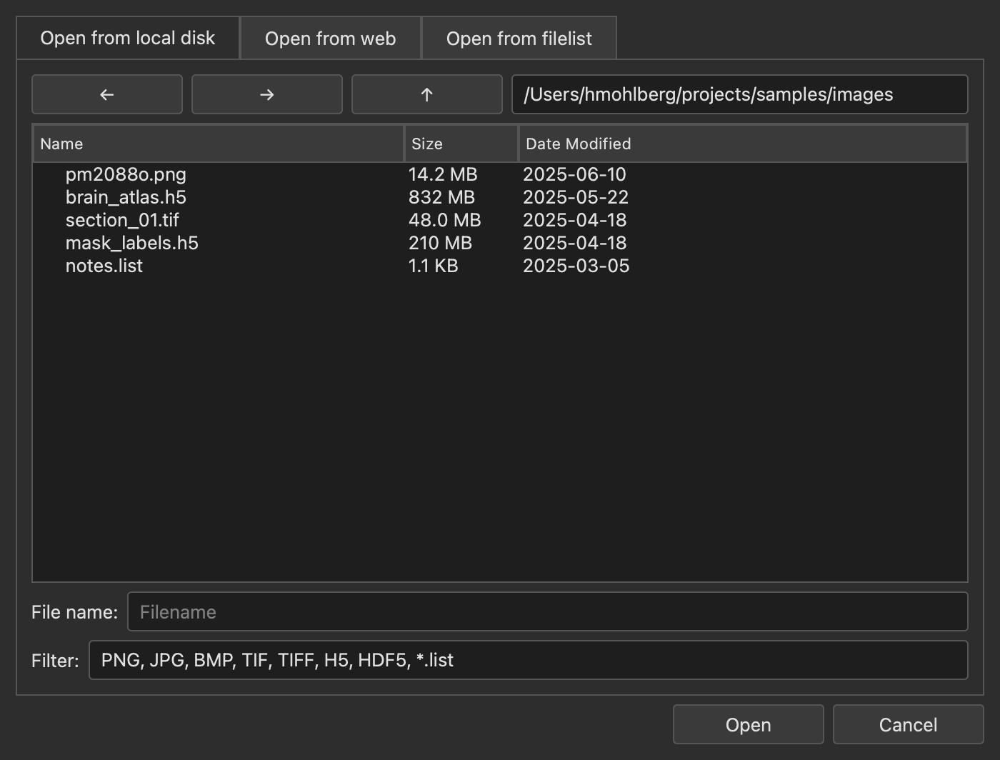
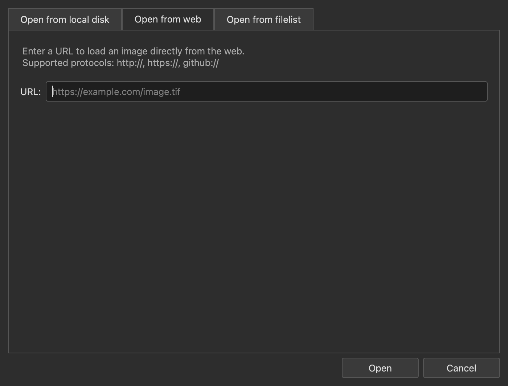
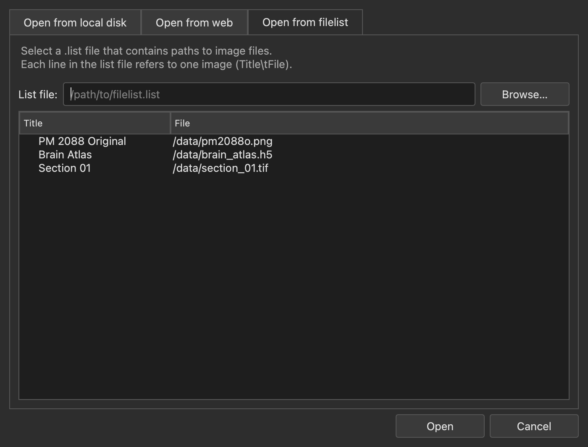
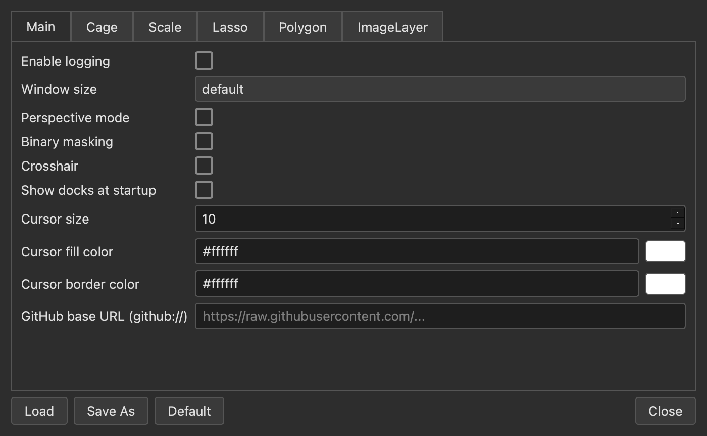
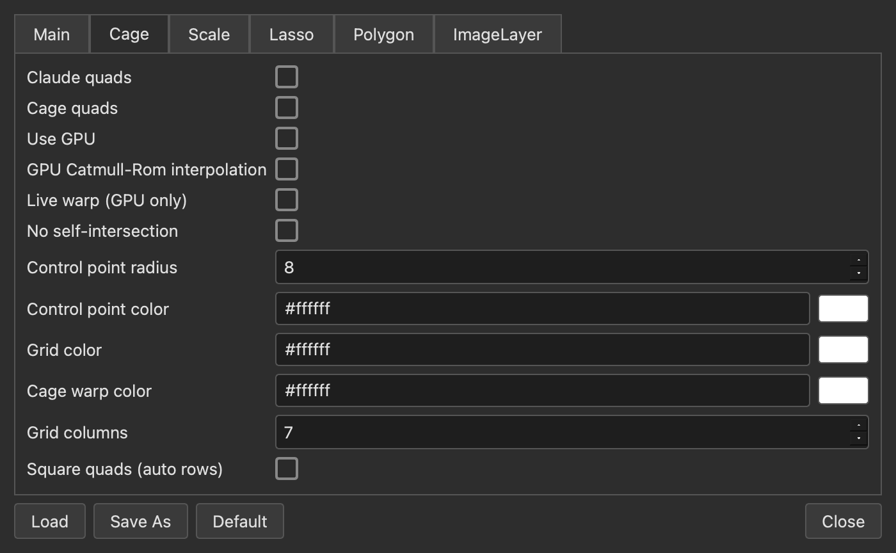
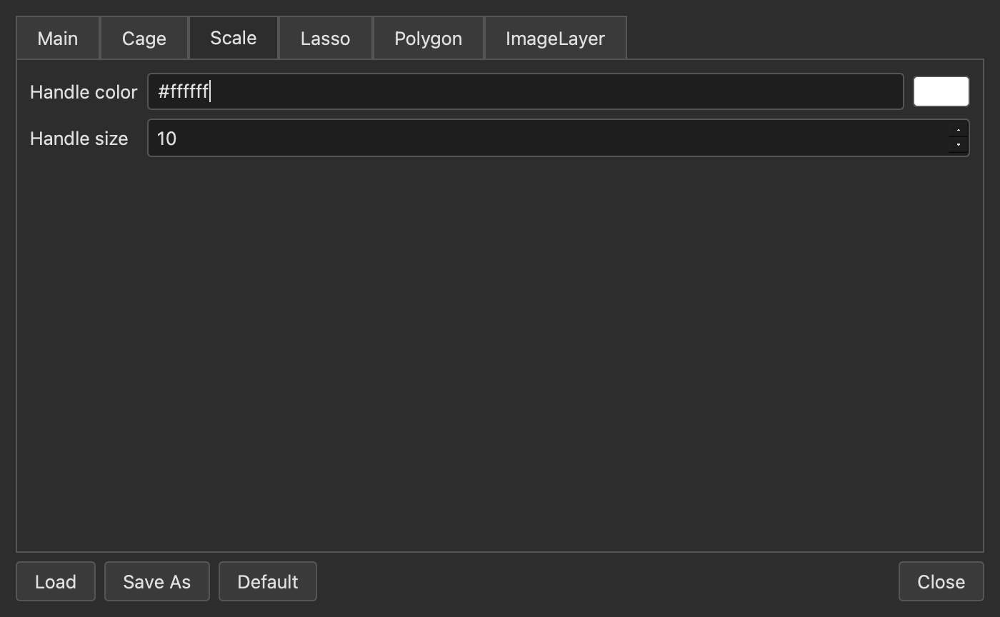
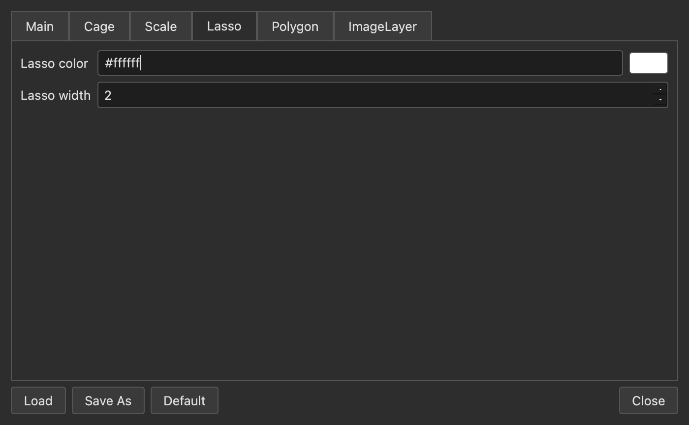
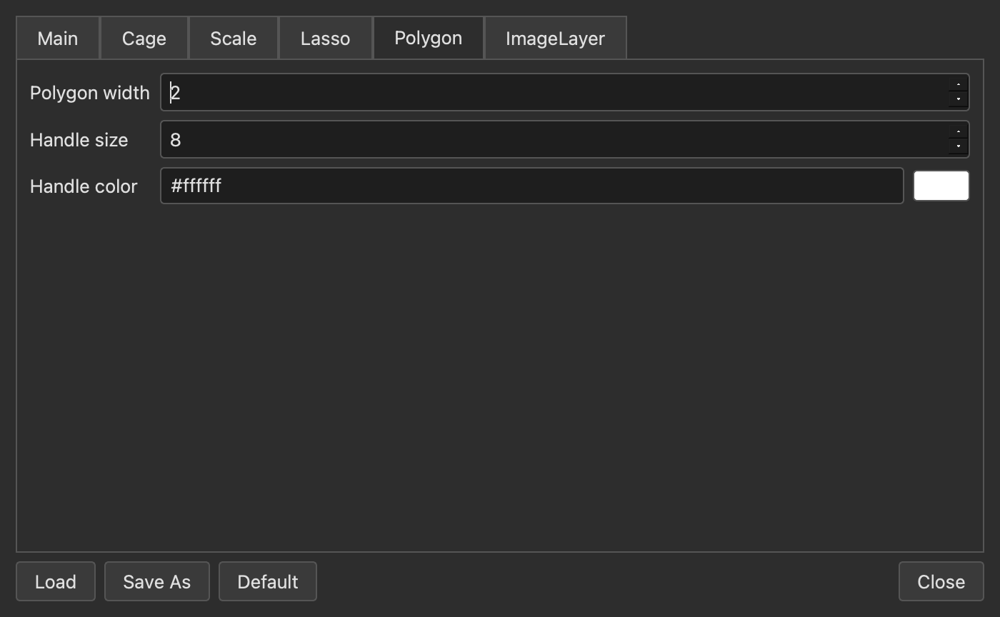
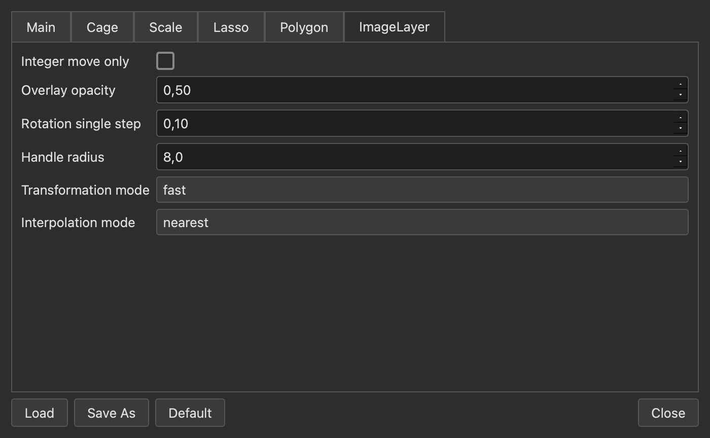

.. _dialogs:

Dialogs
=======

ImageEditor provides several dialogs and tool-specific control strips:
the **Open Image dialog** for loading image files,
the **Configuration dialog** for adjusting all application-wide settings,
and the **Inpainting** toolbar with its **PatchMatch Options** dialog.

.. contents:: Contents
   :local:
   :depth: 2

.. _open-dialog:

Open Image Dialog
-----------------

Opened via ``File → Open`` (or the toolbar button), the dialog is split into three tabs.

Tab: Open from local disk
~~~~~~~~~~~~~~~~~~~~~~~~~~

   *Open from local disk* tab: embedded file browser.

Shows a Qt file dialog (``DontUseNativeDialog``).
Double-clicking a file accepts the selection and opens the image immediately.

Supported file formats:

.. list-table::
   :widths: 20 80
   :header-rows: 1

   * - Format
     - Description
   * - PNG, JPG, BMP
     - Common raster formats
   * - TIF / TIFF
     - Tagged Image File (including BigTIFF)
   * - H5 / HDF5
     - Hierarchical Data Format – opens an additional HDF5 browser dialog
   * - .list
     - Text file containing a list of image paths (→ *Open from filelist* tab)

Tab: Open from web
~~~~~~~~~~~~~~~~~~~

   *Open from web* tab: load an image directly from a URL.

Loads an image directly from a URL.  Supported protocols:

* ``http://`` / ``https://`` – direct link to an image file
* ``github://`` – shorthand for raw GitHub content; the base URL is configured in the
  :ref:`config-main` tab of the Configuration dialog.

Tab: Open from filelist
~~~~~~~~~~~~~~~~~~~~~~~~

   *Open from filelist* tab: image file list.

Loads a ``.list`` text file containing ``Title\tFilepath`` entries, one per line.
All entries are displayed in a two-column table (**Title** / **File**).
Double-clicking a row opens the corresponding image.

Use **Browse list file** to select a ``.list`` file from disk.

.. _config-dialog:

Configuration Dialog
--------------------

Opened via ``Edit → Config``.  The dialog has six tabs and four global buttons:

.. list-table::
   :widths: 20 80
   :header-rows: 1

   * - Button
     - Action
   * - **Load**
     - Load settings from an ``.ini`` file
   * - **Save As**
     - Save current settings to an ``.ini`` file
   * - **Default**
     - Reset all settings to their default values
   * - **Close**
     - Close the dialog (changes take effect immediately)

.. _config-main:

Tab: Main
~~~~~~~~~~

   *Main* tab: general application settings.

.. list-table::
   :widths: 30 70
   :header-rows: 1

   * - Option
     - Description
   * - **Enable logging**
     - Enables debug output to the console.
   * - **Window size**
     - Initial window size at startup: ``default``, ``maximum``, ``fullscreen``, ``mni``.
   * - **Perspective mode**
     - Enables perspective transformation mode for image layers.
   * - **Binary masking**
     - Restricts mask values to 0 or 1.
   * - **Crosshair**
     - Shows a crosshair overlay at the cursor position.
   * - **Show docks at startup**
     - Opens all dock panels automatically when the application starts.
   * - **Cursor size** (0–128)
     - Radius of the brush preview circle in pixels.
   * - **Cursor fill color**
     - Fill color of the brush preview cursor circle.
   * - **Cursor border color**
     - Border color of the brush preview cursor circle.
   * - **GitHub base URL**
     - Base URL used to resolve the ``github://`` protocol when loading files from GitHub.

Tab: Cage
~~~~~~~~~~

   *Cage* tab: cage warp settings.

Controls all parameters of the **Cage Warp** tool:

.. list-table::
   :widths: 35 65
   :header-rows: 1

   * - Option
     - Description
   * - **Claude quads**
     - Uses Claude's quad subdivision algorithm for cage warping.
   * - **Cage quads**
     - Activates quad-based cage control instead of triangulation.
   * - **Use GPU**
     - Enables GPU-accelerated cage warp rendering via OpenGL.
   * - **GPU Catmull-Rom interpolation**
     - Uses Catmull-Rom spline interpolation on the GPU.
   * - **Live warp** *(GPU only)*
     - Updates the warp interactively while dragging control points.
   * - **No self-intersection**
     - Prevents cage control points from crossing each other.
   * - **Control point radius** (1–32 px)
     - Display radius of cage control point handles.
   * - **Control point color**
     - Color of the cage control point handles.
   * - **Grid color**
     - Color of the cage grid lines.
   * - **Cage warp color**
     - Color of the cage warp boundary outline.
   * - **Grid columns** (3–33)
     - Number of columns in the cage control grid.
   * - **Square quads**
     - Automatically sets the number of rows so that each cage quad is approximately square.

Tab: Scale
~~~~~~~~~~~

   *Scale* tab: scale and rotation handle appearance.

.. list-table::
   :widths: 30 70
   :header-rows: 1

   * - Option
     - Description
   * - **Handle color**
     - Color of the scale and rotation transform handles.
   * - **Handle size** (1–64 px)
     - Size of the transform handles in pixels.

Tab: Lasso
~~~~~~~~~~~

   *Lasso* tab: freehand selection tool appearance.

.. list-table::
   :widths: 30 70
   :header-rows: 1

   * - Option
     - Description
   * - **Lasso color**
     - Color of the freehand lasso selection outline.
   * - **Lasso width** (0–20 px)
     - Line width of the lasso selection outline in pixels.

Tab: Polygon
~~~~~~~~~~~~~

   *Polygon* tab: polygon tool appearance.

.. list-table::
   :widths: 30 70
   :header-rows: 1

   * - Option
     - Description
   * - **Polygon width** (0–50 px)
     - Line width of the polygon outline.
   * - **Handle size** (1–64 px)
     - Size of the vertex handles in pixels.
   * - **Handle color**
     - Color of the polygon vertex handles.

Tab: ImageLayer
~~~~~~~~~~~~~~~~

   *ImageLayer* tab: image layer transformation settings.

.. list-table::
   :widths: 35 65
   :header-rows: 1

   * - Option
     - Description
   * - **Integer move only**
     - Restricts layer movement to whole pixel positions.
   * - **Overlay opacity** (0.0–1.0)
     - Opacity of the semi-transparent overlay shown when Ctrl-dragging a layer.
   * - **Rotation single step** (0.01°–90°)
     - Angle increment per step when rotating a layer with the rotation handle.
   * - **Handle radius** (1.0–50.0 px)
     - Radius of the rotation and scale transform handles.
   * - **Transformation mode**
     - Rendering quality during transformations: ``fast`` or ``smooth``.
   * - **Interpolation mode**
     - Pixel interpolation used when scaling or rotating layers: ``nearest``, ``linear``, ``bicubic``.

.. _inpainting-tool:

Inpainting Tool
---------------

The Inpainting tool fills a painted region automatically using either the
classical **PatchMatch** algorithm or the AI-based **LaMa** model (requires
onnxruntime).  Activate it by clicking **Inpainting** in the main toolbar; the
inpainting control strip appears below the main toolbar.

.. rubric:: Control strip

.. list-table::
   :header-rows: 1
   :widths: 25 75

   * - Control
     - Description
   * - **Brush**
     - Activates the paint brush.  Click and drag on the canvas to mark the
       region that should be filled.  The painted area is shown as a coloured
       overlay on the base image.
   * - **Eraser**
     - Removes parts of the painted region.  Useful for refining the
       selection before running inpainting.
   * - **Brush size** (1–200 px)
     - Radius of the inpainting brush in pixels.
   * - **Model**
     - Selects the inpainting algorithm:

       - **Classic (PatchMatch)** — texture-synthesis algorithm; no external
         library required; configurable via the **Options** dialog.
       - **LaMa (AI)** — deep-learning model; only available when onnxruntime
         is installed; no user-configurable parameters.
   * - **Options**
     - Opens the :ref:`patchmatch-options` dialog (PatchMatch only).
       For LaMa, clicking this button shows an information message.
   * - **Run**
     - Applies inpainting to the painted region and places the result on a
       new layer above the base image.  The operation is fully undoable via
       the undo stack.

**Workflow**

1. Click **Inpainting** in the main toolbar to activate the tool.
2. Select **Brush** and paint over the area to be filled.
   Use **Eraser** to refine the selection if needed.
3. Select a **Model**.  If PatchMatch is selected, click **Options** to
   configure the texture source and background filter.
4. Click **Run**.  The filled patch appears on a new layer in the Layers dock.
5. Use the Layers dock to toggle the result layer on/off, or drag it to
   adjust the stacking order.

.. note::
   The painted mask is discarded after **Run**.  If you need to redo the
   inpainting, re-paint the region and run again.  The previous result layer
   stays in the project and can be deleted separately.

.. _patchmatch-options:

PatchMatch Options Dialog
~~~~~~~~~~~~~~~~~~~~~~~~~

Opened via the **Options** button when **Classic (PatchMatch)** is the active
model.

.. rubric:: Use reference region as texture source

A checkable group box.  When enabled, PatchMatch samples texture from a
*different* mask label rather than from the surrounding image.  This is useful
when a specific tissue region should be used to fill the hole.

.. list-table::
   :header-rows: 1
   :widths: 30 70

   * - Option
     - Description
   * - **Reference label**
     - Drop-down showing all mask labels currently painted on the image
       (excluding the active inpainting label).  The selected label's region
       is used as the texture source.

The group box is disabled when no other mask labels are present.

.. rubric:: Only replace pixels near background value

A checkable group box.  When enabled, PatchMatch only overwrites pixels whose
grey value is close to the specified background value.  Pixels that differ from
the background by more than the tolerance are left unchanged.

.. list-table::
   :header-rows: 1
   :widths: 30 70

   * - Option
     - Description
   * - **Background value** (0–255)
     - The grey value that defines "background" in the source image.
   * - **Tolerance**
     - Pixels within this distance (in grey value) of the background value are
       considered background and will be replaced.
