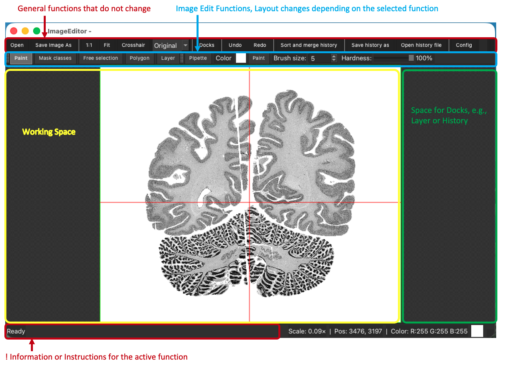
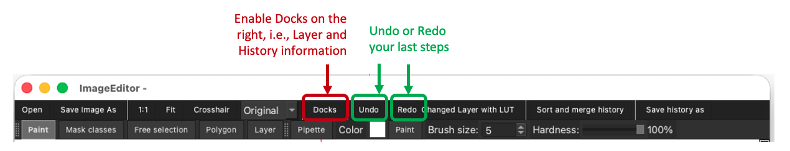
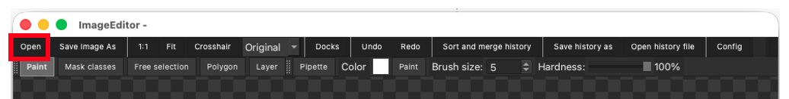
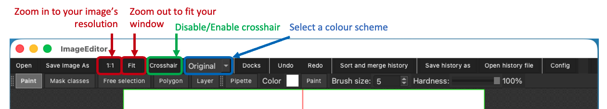
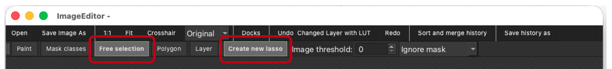
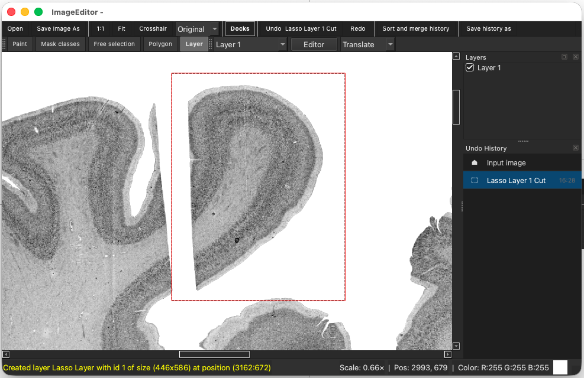
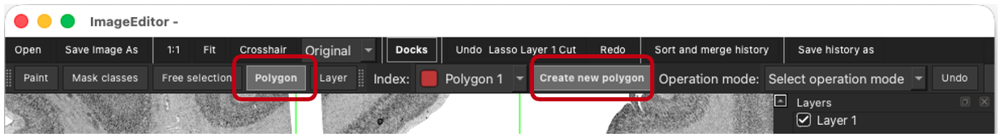
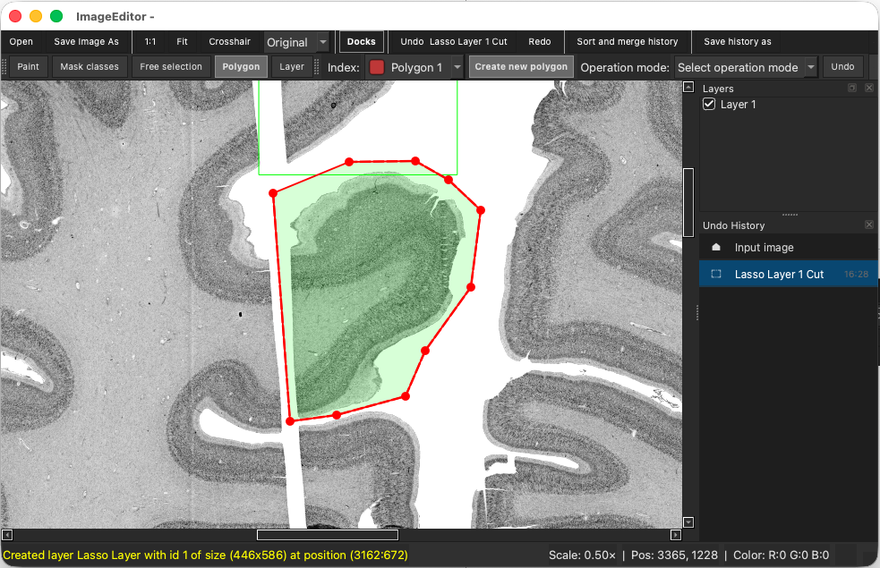

Getting Started
===============

1. Load an Image
----------------

Click **Open** in the top left and load an image from your files or a
sample image, e.g. ``/ImageEditor/samples/images/pm2382o.png``.

2. Zoom and Pan
---------------

* Zoom in and out with your mouse wheel.
* Shift your image view with **Shift + Left Mouse Button**.
* **1:1**: Zoom into your image's resolution with the 1:1 button in the
  top menu row.
* **Fit**: Zoom out to fit the image into your current window.

Create Your First Layer
-----------------------

Lasso
~~~~~

* Selecting **Free selection** changes the corresponding menu on the right.
* Select **Create new lasso**.

* Hold your left mouse button and draw around the image area you would
  like to edit.
* Release your mouse button when you are done.
* You have created your first layer, which is added to the list of layers
  in the **Layers** dock on the right.

Polygon
~~~~~~~

* Selecting **Polygon** changes the corresponding menu on the right.
* Select **Create new polygon**.

* Set a series of points around the image area you would like to edit.
  It will always be a closed polygon; add as many points as you need.
* Confirm your selection with **Esc**.
* You have created your second layer, which is added to the list of layers
  in the **Layers** dock on the right.

.. note::

   Polygon confirmation on macOS is still to be confirmed.

